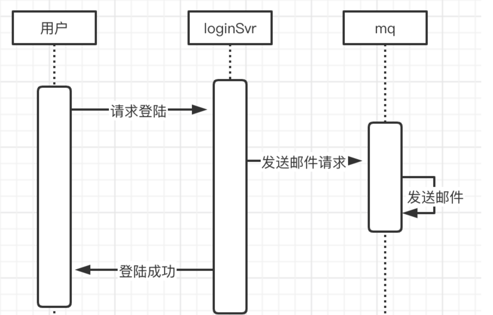

- 消息队列

- publish：进行消息的推送，有两个参数即topic、msg，分别是订阅的主题、要传递的消息
  
- subscribe：消息的订阅，传入订阅的主题，即可完成订阅，并返回对应的channel通道用来接收数据

- unsubscribe：取消订阅，传入订阅的主题和对应的通道

- close：这个的作用就是很明显了，就是用来关闭消息队列的
- broadCast：这个属于内部方法，作用是进行广播，对推送的消息进行广播，保证每一个订阅者都可以收到
- setConditions：这里是用来设置条件，条件就是消息队列的容量，这样我们就可以控制消息队列的大小了

